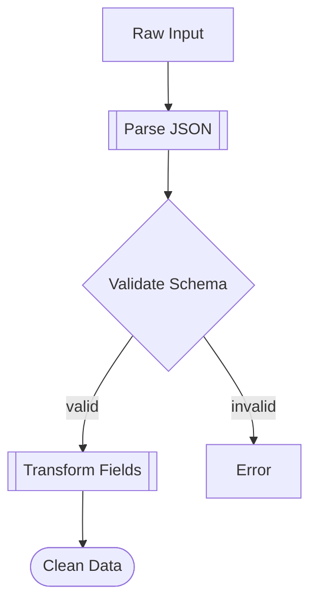

# Threading System - Comprehensive Documentation

> **A multi-tier thread-aware debugging, monitoring, and data correctness system for collaborative human-AI development**

## Table of Contents

1. [Overview](#overview)
2. [Architecture](#architecture)
3. [Maturity Levels](#maturity-levels)
4. [Core Features](#core-features)
5. [Data Correctness Extension](#data-correctness-extension)
6. [Information Flows](#information-flows)
7. [Visualization System](#visualization-system)
8. [Agent Integration](#agent-integration)
9. [Quick Start Guide](#quick-start-guide)
10. [Configuration](#configuration)
11. [Pattern Detection](#pattern-detection)
12. [Best Practices](#best-practices)
13. [Examples](#examples)
14. [API Reference](#api-reference)
15. [Performance](#performance)
16. [Troubleshooting](#troubleshooting)

---

## Overview

The Threading System is a comprehensive framework for tracking, analyzing, and visualizing execution patterns in collaborative human-AI development. It provides:

- **Thread-Aware Debugging**: Track execution across logical threads (e.g., DATA_FLOW, CACHE, VALIDATION)
- **Multi-Tier Maturity**: Progressive adoption from Level 0 (basic logs) to Level 4 (rich decorators)
- **Data Correctness**: Runtime type checking, value validation, and transformation tracking
- **Pattern Detection**: Automatic identification of performance issues, memory leaks, and optimization opportunities
- **Agent Integration**: AI-friendly debugging reports, fix suggestions, and learning extraction
- **Rich Visualization**: Mermaid diagrams, timelines, violation rendering, and interactive dashboards

### Key Benefits

✅ **For Humans**:
- Visual execution flow understanding
- Clear problem identification with evidence
- Actionable recommendations with code snippets
- Progressive complexity (start simple, grow as needed)

✅ **For AI Agents**:
- Structured debugging information
- Contract validation with clear error messages
- Code fix suggestions with examples
- Learning extraction from patterns

✅ **For Teams**:
- Gradual adoption across maturity levels
- Works with partial/inconsistent implementations
- Language-agnostic concepts (implemented in TypeScript)
- Integrates with existing tools (VSCode, Git, CI/CD)

---

## Architecture

### System Components

```
┌─────────────────────────────────────────────────────────────────────┐
│                          Threading System                            │
├───────────────┬──────────────┬───────────────┬──────────────────────┤
│  Decorators   │   Logging    │   Analysis    │   Visualization      │
│ (@ThreadSpec) │ (ThreadLog)  │  (Analyzer)   │   (UI/Mermaid)       │
├───────────────┼──────────────┼───────────────┼──────────────────────┤
│  Tracking     │  Contracts   │  Validation   │   Agent Tools        │
│ (ValueCapture)│ (DataContract│ (Type/Shape)  │ (FixSuggester)       │
│               │  /Constraint)│               │  (DebugHelper)       │
├───────────────┴──────────────┴───────────────┴──────────────────────┤
│                     Multi-Tier Foundation                            │
│  Level 0: Basic Logs  →  Level 4: Rich Decorators + Contracts       │
└─────────────────────────────────────────────────────────────────────┘
```

### Directory Structure

```
packages/core/src/domains/threading/
├── index.ts                    # Main exports
├── types.ts                    # Core type definitions
├── ThreadConfig.ts             # Configuration management
├── ThreadLog.ts                # Runtime logging
│
├── decorators/                 # Decorator layer
│   ├── ThreadSpec.ts          # @ThreadSpec decorator
│   └── ThreadLog.ts           # @ThreadLog decorator
│
├── contracts/                  # Data contract system
│   ├── DataContract.ts        # Contract types and helpers
│   └── index.ts               # Contract exports
│
├── tracking/                   # Execution tracking
│   ├── ValueCapture.ts        # Safe value snapshotting
│   ├── ExecutionTracker.ts    # Complete execution traces
│   └── index.ts               # Tracking exports
│
├── validation/                 # Contract validation
│   ├── TypeValidator.ts       # Type checking
│   ├── ShapeValidator.ts      # Object structure
│   ├── ConstraintValidator.ts # Value constraints
│   ├── InvariantChecker.ts    # Expression evaluation
│   ├── ContractValidator.ts   # Main orchestrator
│   └── index.ts               # Validation exports
│
├── visualization/              # Visualization system
│   ├── ViolationRenderer.ts   # Multi-format violation rendering
│   ├── DataFlowVisualizer.ts  # Mermaid diagrams + timelines
│   ├── DataInspector.ts       # Value comparison
│   └── index.ts               # Visualization exports
│
├── agent/                      # Agent integration
│   ├── FixSuggester.ts        # Code fix suggestions
│   ├── AgentDebugHelper.ts    # Debug reports
│   ├── AgentInstructionInjector.ts  # Template injection
│   └── index.ts               # Agent exports
│
├── analysis/                   # Pattern detection
│   ├── ThreadAnalyzer.ts      # Main analyzer
│   ├── ResilientAnalyzer.ts   # Flexible parsing
│   ├── patterns/              # Pattern detectors
│   │   ├── PerformanceDegradationPattern.ts
│   │   ├── ErrorClusterPattern.ts
│   │   ├── MemoryLeakPattern.ts
│   │   └── CachePattern.ts
│   └── parsers/               # Log parsers
│       └── FlexibleParser.ts  # Resilient parsing
│
├── detection/                  # Maturity detection
│   └── MaturityDetector.ts    # Auto-detect implementation level
│
├── ui/                         # UI controls
│   ├── AdaptiveControlCenter.ts  # VSCode status bar
│   └── LevelSelector.ts       # Maturity level picker
│
├── migration/                  # Level migration
│   └── LevelMigrationManager.ts  # Upgrade helpers
│
├── monitoring/                 # Runtime monitoring
│   └── LevelMonitor.ts        # Coverage tracking
│
├── config/                     # Data correctness config
│   └── DataCorrectnessConfig.ts  # Settings + presets
│
├── logging/                    # Persistent logging
│   └── ThreadLogger.ts        # JSONL writer
│
├── templates/                  # Level-specific templates
│   └── (generated templates)
│
└── examples/                   # Usage examples
    └── (example code)
```

---

## Maturity Levels

The Threading System supports **5 maturity levels** (0-4) for progressive adoption:

### Level 0: Basic Observation
**"What's happening right now?"**

- Use existing logs and console output
- No code changes required
- Manual observation and note-taking
- Good for initial exploration

**Example**:
```javascript
console.log('Fetching user data...');
const user = await db.users.findOne({ id });
console.log('User fetched:', user.name);
```

### Level 1: Semantic Logging
**"Which logical thread is this?"**

- Add `[THREAD:X]` prefix to existing logs
- Zero dependencies, works with any logging library
- Enables filtering and basic grouping
- Easy to adopt incrementally

**Example**:
```javascript
console.log('[THREAD:DATA_FLOW] Fetching user data...');
const user = await db.users.findOne({ id });
console.log('[THREAD:DATA_FLOW] User fetched:', user.name);
```

### Level 2: JSDoc Annotations
**"What are the expectations?"**

- Document threading intent with JSDoc
- No runtime overhead
- Self-documenting code
- Enables static analysis

**Example**:
```javascript
/**
 * @thread DATA_FLOW
 * @timing min=10ms max=100ms
 * @memory max=1MB
 */
async function getUser(id) {
  const user = await db.users.findOne({ id });
  return user;
}
```

### Level 3: Runtime Logging with ThreadLog
**"How does it actually perform?"**

- Runtime tracking with ThreadLog wrapper
- Captures entry, exit, duration, memory
- Writes structured JSONL logs
- Detects simple violations

**Example**:
```javascript
import { trackExecution } from '@agent-brain/core/threading';

async function getUser(id) {
  return trackExecution('getUser', ['DATA_FLOW'], async () => {
    const user = await db.users.findOne({ id });
    return user;
  });
}
```

### Level 4: Rich Decorators + Data Contracts
**"Is the data correct?"**

- TypeScript decorators with full type checking
- Data contracts (types, shapes, constraints)
- Mutation tracking with Proxy
- Rich visualization and agent integration

**Example**:
```typescript
import { ThreadSpec, ThreadLogDecorator, createType, createShape } from '@agent-brain/core/threading';

@ThreadSpec({
  threads: ['DATA_FLOW', 'VALIDATION'],
  timing: { min: 10, max: 100 },
  expects: {
    params: {
      'userId': {
        type: createType('string'),
        constraints: { minLength: 3, pattern: /^[a-z0-9-]+$/ }
      }
    }
  },
  produces: {
    type: createType('object'),
    shape: createShape({
      id: { type: createType('string'), required: true },
      name: { type: createType('string'), required: true }
    })
  }
})
@ThreadLogDecorator('DATA_FLOW', 'VALIDATION')
async function getUser(userId: string): Promise<User> {
  const user = await db.users.findOne({ id: userId });
  return user;
}
```

### Maturity Detection

The system automatically detects your actual implementation level:

```typescript
import { MaturityDetector } from '@agent-brain/core/threading';

const detector = new MaturityDetector();
const result = await detector.detectActualLevel(workspacePath);

console.log('Detected Level:', result.detectedLevel);
console.log('Coverage:', result.coverage);
console.log('Recommendations:', result.recommendations);
```

---

## Core Features

### 1. ThreadSpec Decorator

Mark functions with threading expectations:

```typescript
@ThreadSpec({
  threads: ['DATA_FLOW'],              // Logical threads
  timing: { min: 10, max: 100 },       // Performance expectations
  memory: { max: 1024 * 1024 },        // Memory budget (1MB)
  tags: ['critical', 'user-facing']    // Custom tags
})
```

### 2. Runtime Tracking

Automatic execution tracking:

```typescript
@ThreadLogDecorator('DATA_FLOW')
async function myFunction() {
  // Automatically tracked:
  // - Entry time
  // - Arguments (privacy-aware)
  // - Return value
  // - Duration
  // - Memory delta
  // - Mutations
  // - Exceptions
}
```

### 3. JSONL Logging

Structured logs for analysis:

```jsonl
{"type":"entry","context":"UserService.getUser","threads":["DATA_FLOW"],"timestamp":1698765432100,"args":[{"value":"user-123"}]}
{"type":"exit","context":"UserService.getUser","threads":["DATA_FLOW"],"timestamp":1698765432145,"duration":45,"result":{"id":"user-123","name":"John"}}
{"type":"delta","context":"UserService.getUser","threads":["DATA_FLOW"],"subtype":"timing","severity":"warning","expected":"max 100ms","actual":"145ms"}
```

### 4. Pattern Detection

Automatic issue identification:

- **Performance Degradation**: Progressive slowdown detection
- **Error Clustering**: Burst error identification
- **Memory Leaks**: Continuous growth detection
- **Cache Opportunities**: Repeated expensive calls
- **Cache Thrashing**: Frequent evictions
- **Cache Inefficiency**: Bimodal distributions

---

## Data Correctness Extension

### Overview

The Data Correctness Extension adds comprehensive runtime validation:

- **Type Checking**: Primitives, unions, literals, generics, nullable
- **Shape Validation**: Nested objects, required fields, extra field detection
- **Constraint Validation**: Numeric ranges, string patterns, array constraints
- **Invariant Checking**: Pre/post-conditions, expression evaluation
- **Transformation Tracking**: Data flow visualization
- **Mutation Detection**: Proxy-based change tracking

### Data Contracts

Define complete data contracts:

```typescript
import { createType, createShape, createNumber, createString } from '@agent-brain/core/threading';

@ThreadSpec({
  threads: ['USER_SERVICE'],
  expects: {
    params: {
      'userData': {
        type: createType('object'),
        shape: createShape({
          username: {
            type: createString({ minLength: 3, maxLength: 20 }),
            required: true
          },
          email: {
            type: createString({ pattern: /^[^\s@]+@[^\s@]+\.[^\s@]+$/ }),
            required: true
          },
          age: {
            type: createNumber({ min: 13, max: 120 }),
            required: false
          }
        })
      }
    },
    preconditions: [
      'args[0].username !== undefined',
      'args[0].email.includes("@")'
    ]
  },
  produces: {
    type: createType('object'),
    shape: createShape({
      id: { type: createType('string'), required: true },
      username: { type: createType('string'), required: true },
      createdAt: { type: createType('number'), required: true }
    }),
    postconditions: [
      'result.id.length > 0',
      'result.createdAt > 0'
    ]
  },
  invariants: [
    'this.userCount >= 0',
    'this.database !== null'
  ]
})
```

### Type System

Full TypeScript-like type support:

```typescript
// Primitives
createType('string')
createType('number')
createType('boolean')
createType('null')
createType('undefined')

// Nullable
createType('string', { nullable: true })

// Unions
createUnion(
  createType('string'),
  createType('number')
)

// Literals
createLiteral('active')
createLiteral(42)

// Union of literals (enums)
createUnion(
  createLiteral('pending'),
  createLiteral('active'),
  createLiteral('completed')
)

// Generics
createType('array', {
  generic: createType('string')
})

// Complex nested
createType('object', {
  shape: createShape({
    users: {
      type: createType('array', {
        generic: createType('object', {
          shape: createShape({
            id: { type: createType('string'), required: true },
            name: { type: createType('string'), required: true }
          })
        })
      }),
      required: true
    }
  })
})
```

### Constraint System

Rich validation constraints:

```typescript
// Numeric constraints
constraints: {
  min: 0,
  max: 100,
  multipleOf: 5,
  precision: 2
}

// String constraints
constraints: {
  minLength: 3,
  maxLength: 50,
  pattern: /^[a-z0-9-]+$/
}

// Array constraints
constraints: {
  minItems: 1,
  maxItems: 10,
  uniqueItems: true,
  itemType: createType('string')
}

// Custom validation
constraints: {
  validate: (value) => value > 0 || 'Must be positive'
}
```

### Invariant Checking

Safe expression evaluation without `eval()`:

```typescript
// Supported operators: ===, !==, >, <, >=, <=, &&, ||, !
preconditions: [
  'args[0].length > 0',
  'args[1] >= 0 && args[1] < 100',
  'this.isAuthenticated === true'
]

postconditions: [
  'result !== null',
  'result.id.length > 0',
  'result.createdAt > Date.now() - 1000'
]

invariants: [
  'this.count >= 0',
  'this.maxSize > 0',
  'this.items.length <= this.maxSize'
]
```

### Value Capture

Privacy-aware value snapshotting:

```typescript
// Automatic redaction of sensitive fields
const snapshot = valueCapture.capture({
  username: 'john',
  password: 'secret123',  // → [REDACTED]
  apiKey: 'key_abc',      // → [REDACTED]
  email: 'john@example.com'
});

// Circular reference handling
const obj = { name: 'John' };
obj.self = obj;  // Circular
const snapshot = valueCapture.capture(obj);
// → { name: 'John', self: '[Circular Reference]' }

// Truncation for large values
const bigString = 'x'.repeat(10000);
const snapshot = valueCapture.capture(bigString);
// → { value: 'xxx...', truncated: true }
```

### Privacy Configuration

Customize redaction patterns:

```typescript
import { setGlobalDataCorrectnessConfig } from '@agent-brain/core/threading';

setGlobalDataCorrectnessConfig({
  privacy: {
    enabled: true,
    redactionPatterns: [
      /password/i,
      /token/i,
      /secret/i,
      /ssn/i,
      /credit.*card/i
    ],
    maxStringLength: 1000,
    maxArrayLength: 100,
    maxDepth: 10,
    redactUrls: false,
    redactEmails: false
  }
});
```

---

## Information Flows

### 1. Development-Time Flow

```
Developer writes code with @ThreadSpec
         ↓
TypeScript compiler validates syntax
         ↓
reflect-metadata stores decorator info
         ↓
Code compiles with zero runtime overhead
```

### 2. Runtime Execution Flow

```
Function called
         ↓
@ThreadLogDecorator intercepts
         ↓
Capture entry (args, timestamp, context)
         ↓
Validate input contracts
         ↓
Create tracking proxy for mutations
         ↓
Execute original function
         ↓
Track transformations
         ↓
Capture exit (result, duration, memory)
         ↓
Validate output contracts
         ↓
Check invariants
         ↓
Log execution trace to JSONL
         ↓
Return result to caller
```

### 3. Analysis Flow

```
ThreadLogger writes to JSONL files
         ↓
ThreadAnalyzer reads logs (batch/streaming)
         ↓
ResilientAnalyzer parses with flexibility
         ↓
Pattern Detectors analyze (parallel)
         ↓
Generate insights and recommendations
         ↓
Create AnalysisReport
         ↓
Visualize in UI or export
```

### 4. Violation Flow

```
Contract violation detected
         ↓
ContractViolation created
         ↓
ViolationRenderer formats (text/MD/HTML)
         ↓
FixSuggester generates code fixes
         ↓
AgentDebugHelper creates report
         ↓
Display to developer or agent
```

### 5. Data Flow Visualization

```
ExecutionTrace captured
         ↓
DataFlowDiagram extracted
         ↓
Nodes: input, transformation, validation, output
         ↓
Edges: data movement with labels
         ↓
DataFlowVisualizer renders Mermaid
         ↓
Display in Markdown or WebView
```

---

## Visualization System

### 1. Violation Rendering

Multi-format violation display:

```typescript
import { renderViolations } from '@agent-brain/core/threading';

// Render as Markdown
const markdown = renderViolations(violations, {
  format: 'markdown',
  includeEvidence: true
});

// Render as HTML
const html = renderViolations(violations, {
  format: 'html',
  includeStyles: true
});

// Render as text (ANSI colors)
const text = renderViolations(violations, {
  format: 'text',
  colorize: true
});
```

**Example Markdown Output**:
```markdown
## ❌ Critical Violation

**Type**: input
**Message**: Parameter validation failed

### Expected vs Actual

| | Expected | Actual |
|---|---|---|
| **Type** | `string` | `number` |
| **Value** | length >= 3 | `42` |

💡 **Suggestion**: Convert the input to a string using `String(value)` or `value.toString()`

**Location**: args[0]
**Function**: UserService.getUser
```

### 2. Mermaid Diagrams

Automatic data flow visualization:

```typescript
import { visualizeTrace } from '@agent-brain/core/threading';

const mermaid = visualizeTrace(trace, {
  format: 'mermaid',
  includeDataFlow: true
});
```

**Example Output**:


### 3. Timeline Visualization

Execution timeline with events:

```typescript
const timeline = visualizeTrace(trace, {
  format: 'timeline',
  includeTimestamps: true
});
```

**Example Output**:
```
10:23:45.100  🟢 Entry    UserService.getUser(userId="user-123")
10:23:45.103  🔄 Transform  userId → queryParams
10:23:45.110  🔍 Validation  schema check passed
10:23:45.145  🟢 Exit      duration=45ms, result={...}
```

### 4. Value Inspection

Side-by-side value comparison:

```typescript
import { compareValues } from '@agent-brain/core/threading';

const comparison = compareValues(expected, actual, {
  showTypes: true,
  showSizes: true
});
```

**Example Output**:
```markdown
### Expected vs Actual

| | Expected | Actual |
|---|---|---|
| **Value** | `"user-123"` | `123` |
| **Type** | `string` | `number` |
| **Size** | 8 chars | 8 bytes |

❌ Type mismatch
```

### 5. Interactive Dashboard

VSCode WebView with rich UI:

- Pattern cards with color-coded severity
- Confidence meters and impact indicators
- Expandable evidence sections
- One-click code navigation
- Export/import capabilities
- Real-time analysis triggers

---

## Agent Integration

### Fix Suggestions

Automatic code fix generation:

```typescript
import { suggestFixes } from '@agent-brain/core/threading';

const violations = trace.violations;
const suggestions = suggestFixes(violations);

suggestions.forEach(suggestion => {
  console.log(suggestion.description);
  console.log(suggestion.explanation);
  console.log('\nFix:');
  console.log(suggestion.codeSnippet);
  console.log('\nPriority:', suggestion.priority);
});
```

**Example Output**:
```
Convert number to string

The function expects a string parameter but received a number.
Ensure the input is converted before calling the function.

Fix:
const value = String(args[0]) // or args[0].toString()

Priority: high
```

### Debug Reports

Comprehensive agent-friendly reports:

```typescript
import { generateDebugReport } from '@agent-brain/core/threading';

const report = generateDebugReport(trace);

console.log('# Debug Report\n');
console.log('## Summary');
console.log(report.summary);

console.log('\n## Violations');
report.violations.forEach((v, i) => {
  console.log(`\n### ${i + 1}. ${v.violation.message}`);
  console.log(`**Explanation**: ${v.explanation}`);
  console.log(`**Impact**: ${v.impact}`);
  console.log(`**How to Fix**:`);
  v.howToFix.forEach(step => console.log(`- ${step}`));
});

console.log('\n## Fix Suggestions');
report.suggestions.forEach((s, i) => {
  console.log(`\n${i + 1}. ${s.description}`);
  console.log(s.explanation);
  if (s.codeSnippet) {
    console.log('\n```typescript');
    console.log(s.codeSnippet);
    console.log('```');
  }
});

console.log('\n## Code Examples');
report.examples.forEach(ex => {
  console.log(`\n### ${ex.title}`);
  console.log(ex.description);
  console.log('\n```' + ex.language);
  console.log(ex.code);
  console.log('```');
});

console.log('\n## Key Learnings');
report.learnings.forEach(learning => {
  console.log(`📚 ${learning}`);
});

console.log('\n## Next Steps');
report.nextSteps.forEach(step => {
  console.log(step);
});
```

### Agent Instruction Injection

Templates with embedded guidance:

```typescript
import { AgentInstructionInjector } from '@agent-brain/core/threading';

const injector = new AgentInstructionInjector();

// Get level-specific instructions
const instructions = injector.getInstructionsForLevel(4);

// Apply to template
const template = injector.injectInstructions(baseTemplate, {
  level: 4,
  threads: ['DATA_FLOW', 'VALIDATION'],
  includeExamples: true
});
```

---

## Quick Start Guide

### Installation

The Threading System is built into Agent Brain Platform:

```bash
npm install @agent-brain/core
```

### Level 1: Semantic Logging (5 minutes)

```javascript
// Add [THREAD:X] to your existing logs
console.log('[THREAD:DATA_FLOW] Fetching user data');
const user = await db.users.findOne({ id });
console.log('[THREAD:DATA_FLOW] User fetched:', user.name);
```

### Level 2: JSDoc Annotations (10 minutes)

```javascript
/**
 * @thread DATA_FLOW
 * @timing max=100ms
 */
async function getUser(id) {
  const user = await db.users.findOne({ id });
  return user;
}
```

### Level 3: Runtime Tracking (20 minutes)

```javascript
import { trackExecution } from '@agent-brain/core/threading';

async function getUser(id) {
  return trackExecution('getUser', ['DATA_FLOW'], async () => {
    const user = await db.users.findOne({ id });
    return user;
  });
}
```

### Level 4: Full System (1 hour)

```typescript
import { ThreadSpec, ThreadLogDecorator, createType } from '@agent-brain/core/threading';

@ThreadSpec({
  threads: ['DATA_FLOW'],
  timing: { max: 100 },
  expects: {
    params: {
      'userId': {
        type: createType('string'),
        constraints: { minLength: 3 }
      }
    }
  },
  produces: {
    type: createType('object')
  }
})
@ThreadLogDecorator('DATA_FLOW')
async function getUser(userId: string): Promise<User> {
  const user = await db.users.findOne({ id: userId });
  return user;
}
```

---

## Configuration

### Thread Configuration

```typescript
import { setGlobalThreadConfig } from '@agent-brain/core/threading';

setGlobalThreadConfig({
  enabled: true,
  mode: 'development',  // disabled|development|debugging|learning
  threads: {
    definitions: [
      {
        name: 'DATA_FLOW',
        description: 'Data retrieval and transformation',
        color: '#00d4ff',
        critical: true
      }
    ],
    active: ['DATA_FLOW', 'VALIDATION'],
    sampling: {
      default: 100,      // 1 in 100 calls
      performance: 10,   // More frequent
      error: 1          // Always log errors
    }
  },
  logging: {
    path: '.agent-brain/threading-logs',
    format: 'jsonl',
    buffer: {
      enabled: true,
      size: 1000,
      flushInterval: 5000  // 5 seconds
    }
  },
  analysis: {
    enabled: true,
    mode: 'batch',
    interval: '5m'
  }
});
```

### Data Correctness Configuration

```typescript
import { setGlobalDataCorrectnessConfig, DEVELOPMENT_CONFIG, PRODUCTION_CONFIG, TESTING_CONFIG } from '@agent-brain/core/threading';

// Use preset
setGlobalDataCorrectnessConfig(DEVELOPMENT_CONFIG);

// Or customize
setGlobalDataCorrectnessConfig({
  enabled: true,
  privacy: {
    enabled: true,
    redactionPatterns: [/password/i, /token/i],
    maxStringLength: 1000,
    maxArrayLength: 100,
    maxDepth: 10
  },
  capture: {
    mode: 'full',  // full|sampled|disabled
    samplingRate: 0.1,
    captureArgs: true,
    captureReturnValues: true,
    captureMutations: true
  },
  validation: {
    enabled: true,
    failOnViolations: false,
    failOnSeverity: 'error',  // info|warning|error|critical
    checkPreconditions: true,
    checkPostconditions: true,
    checkInvariants: true
  },
  visualization: {
    defaultFormat: 'markdown',  // text|markdown|html
    detailLevel: 'standard',    // minimal|standard|verbose
    generateDiagrams: true
  }
});
```

### Configuration Presets

```typescript
// Development: verbose, all features
import { DEVELOPMENT_CONFIG } from '@agent-brain/core/threading';
setGlobalDataCorrectnessConfig(DEVELOPMENT_CONFIG);

// Production: minimal overhead, 1% sampling
import { PRODUCTION_CONFIG } from '@agent-brain/core/threading';
setGlobalDataCorrectnessConfig(PRODUCTION_CONFIG);

// Testing: strict validation, fail on warnings
import { TESTING_CONFIG } from '@agent-brain/core/threading';
setGlobalDataCorrectnessConfig(TESTING_CONFIG);

// Disabled: zero overhead
import { DISABLED_CONFIG } from '@agent-brain/core/threading';
setGlobalDataCorrectnessConfig(DISABLED_CONFIG);
```

---

## Pattern Detection

### Performance Degradation

Detects progressive slowdown:

```typescript
{
  name: "Performance Degradation",
  type: "performance_degradation",
  confidence: 0.85,
  impact: "high",
  description: "Execution time increased by 150% over 50 calls",
  evidence: {
    sampleSize: 50,
    firstDuration: 45,
    lastDuration: 112,
    degradationPercent: 149,
    trend: {
      slope: 1.34,
      correlation: 0.85
    }
  },
  recommendations: [
    {
      title: "Investigate Resource Accumulation",
      priority: "high",
      steps: [
        "Check for unclosed database connections",
        "Review memory usage patterns",
        "Profile with V8 heap snapshots"
      ]
    }
  ]
}
```

### Error Clustering

Identifies error bursts:

```typescript
{
  name: "Error Cluster",
  type: "error_cluster",
  confidence: 0.92,
  impact: "critical",
  description: "15 errors in 5-second window",
  evidence: {
    errorCount: 15,
    windowSize: 5000,
    errorRate: 3.0,
    similarityScore: 0.78
  }
}
```

### Memory Leak

Detects continuous growth:

```typescript
{
  name: "Memory Leak",
  type: "memory_leak",
  confidence: 0.88,
  impact: "high",
  description: "Memory grew by 500% over 100 calls",
  evidence: {
    initialMemory: "512KB",
    finalMemory: "3MB",
    totalGrowth: "2.5MB",
    growthRate: "52KB/call",
    acceleration: "2KB/call²"
  }
}
```

### Cache Patterns

Identifies caching opportunities:

```typescript
// Cache Opportunity
{
  name: "Cache Opportunity",
  type: "cache_opportunity",
  confidence: 0.75,
  impact: "medium",
  description: "Repeated expensive calls with same arguments",
  evidence: {
    repeatRate: 0.65,
    avgDuration: 145,
    potentialSavings: "2.9s"
  }
}

// Cache Thrashing
{
  name: "Cache Thrashing",
  type: "cache_thrashing",
  confidence: 0.81,
  impact: "high",
  description: "Frequent cache evictions detected",
  evidence: {
    evictionRate: 0.85,
    hitRate: 0.15
  }
}
```

---

## Best Practices

### 1. Start Small, Grow Gradually

```
Week 1: Add semantic logging to critical functions
Week 2: Document with JSDoc annotations
Week 3: Enable runtime tracking for hot paths
Week 4: Add data contracts to API boundaries
```

### 2. Use Appropriate Maturity Levels

- **Level 0-1**: Exploration and debugging
- **Level 2**: Documentation and team communication
- **Level 3**: Performance monitoring
- **Level 4**: Critical paths and API boundaries

### 3. Configure for Environment

```typescript
// Development
const config = {
  enabled: true,
  capture: { mode: 'full' },
  validation: { failOnViolations: false },
  visualization: { detailLevel: 'verbose' }
};

// Production
const config = {
  enabled: true,
  capture: { mode: 'sampled', samplingRate: 0.01 },
  validation: { failOnViolations: false },
  visualization: { detailLevel: 'minimal' }
};

// CI/CD
const config = {
  enabled: true,
  capture: { mode: 'full' },
  validation: { failOnViolations: true, failOnSeverity: 'error' },
  visualization: { detailLevel: 'standard' }
};
```

### 4. Privacy First

Always configure privacy settings:

```typescript
{
  privacy: {
    enabled: true,
    redactionPatterns: [
      /password/i,
      /token/i,
      /secret/i,
      /ssn/i,
      /credit.*card/i,
      // Add domain-specific patterns
      /api.*key/i,
      /auth/i
    ],
    maxStringLength: 1000,  // Truncate large strings
    maxArrayLength: 100,    // Truncate large arrays
    maxDepth: 10            // Limit nesting
  }
}
```

### 5. Use Sampling in Production

```typescript
{
  capture: {
    mode: 'sampled',
    samplingRate: 0.01,  // 1% of calls
    captureArgs: true,
    captureReturnValues: true,
    captureMutations: false,  // Disable for performance
    captureTransformations: false
  }
}
```

### 6. Analyze Regularly

```bash
# Daily batch analysis
npm run threading:analyze

# Real-time during debugging
npm run threading:watch

# Generate reports
npm run threading:report
```

### 7. Learn from Patterns

Extract learnings and share with team:

```typescript
const report = await analyzer.analyze(entries);

// Export as knowledge item
await knowledge.create({
  type: 'learning',
  title: `Performance Pattern: ${report.patterns[0].name}`,
  content: report.summary,
  tags: ['threading', 'performance'],
  metadata: {
    pattern: report.patterns[0],
    recommendations: report.recommendations
  }
});
```

---

## Examples

### Example 1: API Endpoint with Full Validation

```typescript
import { ThreadSpec, ThreadLogDecorator, createType, createShape } from '@agent-brain/core/threading';

class UserController {
  @ThreadSpec({
    threads: ['API', 'DATA_FLOW', 'VALIDATION'],
    timing: { max: 200 },
    memory: { max: 5 * 1024 * 1024 }, // 5MB
    expects: {
      params: {
        'userId': {
          type: createType('string'),
          constraints: {
            pattern: /^[0-9a-f]{8}-[0-9a-f]{4}-[0-9a-f]{4}-[0-9a-f]{4}-[0-9a-f]{12}$/,
            minLength: 36,
            maxLength: 36
          }
        }
      },
      preconditions: [
        'this.isAuthenticated === true',
        'this.database.isConnected === true'
      ]
    },
    produces: {
      type: createType('object'),
      shape: createShape({
        id: { type: createType('string'), required: true },
        username: { type: createType('string'), required: true },
        email: { type: createType('string'), required: true },
        createdAt: { type: createType('number'), required: true }
      }),
      postconditions: [
        'result.id === args[0]',
        'result.createdAt > 0'
      ]
    }
  })
  @ThreadLogDecorator('API', 'DATA_FLOW', 'VALIDATION')
  async getUser(userId: string): Promise<User> {
    const user = await this.userService.findById(userId);
    if (!user) {
      throw new NotFoundError(`User ${userId} not found`);
    }
    return user;
  }
}
```

### Example 2: Background Job with Memory Monitoring

```typescript
@ThreadSpec({
  threads: ['BACKGROUND_JOB', 'EMAIL'],
  timing: { max: 30000 }, // 30 seconds
  memory: { max: 100 * 1024 * 1024 }, // 100MB
  tags: ['batch', 'email']
})
@ThreadLogDecorator('BACKGROUND_JOB', 'EMAIL')
async function sendBulkEmails(userIds: string[]): Promise<void> {
  console.log('[THREAD:BACKGROUND_JOB] Starting bulk email send');

  for (const userId of userIds) {
    const user = await db.users.findOne({ id: userId });
    await emailService.send(user.email, template);
  }

  console.log('[THREAD:BACKGROUND_JOB] Completed bulk email send');
}
```

### Example 3: Data Transformation Pipeline

```typescript
@ThreadSpec({
  threads: ['DATA_PIPELINE', 'TRANSFORMATION'],
  expects: {
    params: {
      'rawData': {
        type: createType('string'),
        constraints: { minLength: 1 }
      }
    }
  },
  produces: {
    type: createType('object'),
    shape: createShape({
      id: { type: createType('string'), required: true },
      data: { type: createType('object'), required: true },
      processedAt: { type: createType('number'), required: true }
    })
  },
  dataFlow: {
    nodes: [
      { id: 'input', type: 'input', label: 'Raw Data' },
      { id: 'parse', type: 'transformation', label: 'Parse JSON' },
      { id: 'validate', type: 'validation', label: 'Validate Schema' },
      { id: 'transform', type: 'transformation', label: 'Transform Fields' },
      { id: 'output', type: 'output', label: 'Clean Data' }
    ],
    edges: [
      { from: 'input', to: 'parse', label: 'raw' },
      { from: 'parse', to: 'validate', label: 'parsed' },
      { from: 'validate', to: 'transform', label: 'validated' },
      { from: 'transform', to: 'output', label: 'transformed' }
    ]
  }
})
@ThreadLogDecorator('DATA_PIPELINE', 'TRANSFORMATION')
async function transformData(rawData: string): Promise<TransformedData> {
  // Parse
  const parsed = JSON.parse(rawData);

  // Validate
  if (!parsed.id || !parsed.name) {
    throw new ValidationError('Invalid schema');
  }

  // Transform
  const transformed = {
    id: parsed.id.toUpperCase(),
    data: {
      name: parsed.name.trim(),
      timestamp: Date.now()
    },
    processedAt: Date.now()
  };

  return transformed;
}
```

### Example 4: Custom Analysis

```typescript
import { ThreadAnalyzer } from '@agent-brain/core/threading';
import { readFileSync } from 'fs';

async function analyzePerformance() {
  // Read logs
  const logData = readFileSync('.agent-brain/threading-logs/thread-2024-01-01.jsonl', 'utf-8');
  const entries = logData.trim().split('\n').map(line => JSON.parse(line));

  // Create custom analyzer
  const analyzer = new ThreadAnalyzer({
    enabledDetectors: ['performance_degradation', 'memory_leak'],
    sensitivity: 'high',
    minSampleSize: 5
  });

  // Analyze
  const report = await analyzer.analyze(entries);

  // Process results
  const criticalPatterns = report.patterns.filter(p => p.impact === 'critical');

  if (criticalPatterns.length > 0) {
    console.log('🚨 Critical issues detected:');
    criticalPatterns.forEach(pattern => {
      console.log(`\n${pattern.name}`);
      console.log(pattern.description);
      console.log('Recommendations:');
      pattern.recommendations?.forEach(rec => {
        console.log(`- ${rec.title}`);
      });
    });

    // Alert team
    await slack.send({
      channel: '#performance',
      text: `Critical performance issues detected`,
      attachments: [{ text: report.summary }]
    });
  }

  // Export report
  writeFileSync('analysis-report.json', JSON.stringify(report, null, 2));
}
```

---

## API Reference

### Core Exports

```typescript
// Decorators
export { ThreadSpec, getThreadSpec, getAllThreadSpecs } from './decorators/ThreadSpec';
export { ThreadLog as ThreadLogDecorator } from './decorators/ThreadLog';

// Logging
export { ThreadLog, getGlobalThreadLog, trackExecution } from './ThreadLog';
export { ThreadLogger } from './logging/ThreadLogger';

// Configuration
export { ThreadConfigManager, getGlobalThreadConfig, setGlobalThreadConfig } from './ThreadConfig';

// Contracts
export * from './contracts';
export { createType, createUnion, createLiteral, createShape, createString, createNumber, createArray } from './contracts/DataContract';

// Tracking
export { ValueCapture } from './tracking/ValueCapture';
export { ExecutionTracker } from './tracking/ExecutionTracker';

// Validation
export { ContractValidator, getGlobalContractValidator } from './validation/ContractValidator';
export { TypeValidator } from './validation/TypeValidator';
export { ShapeValidator } from './validation/ShapeValidator';
export { ConstraintValidator } from './validation/ConstraintValidator';
export { InvariantChecker } from './validation/InvariantChecker';

// Visualization
export { ViolationRenderer, renderViolation, renderViolations } from './visualization/ViolationRenderer';
export { DataFlowVisualizer, visualizeTrace } from './visualization/DataFlowVisualizer';
export { DataInspector, inspectValue, compareValues } from './visualization/DataInspector';

// Agent Integration
export { FixSuggester, suggestFixes } from './agent/FixSuggester';
export { AgentDebugHelper, generateDebugReport } from './agent/AgentDebugHelper';
export { AgentInstructionInjector } from './agent/AgentInstructionInjector';

// Analysis
export { ThreadAnalyzer } from './analysis/ThreadAnalyzer';
export { ResilientAnalyzer } from './analysis/ResilientAnalyzer';

// Multi-Tier System
export { MaturityDetector } from './detection/MaturityDetector';
export { AdaptiveControlCenter } from './ui/AdaptiveControlCenter';
export { LevelMigrationManager } from './migration/LevelMigrationManager';

// Data Correctness Config
export * from './config';
export { DEVELOPMENT_CONFIG, PRODUCTION_CONFIG, TESTING_CONFIG, DISABLED_CONFIG } from './config/DataCorrectnessConfig';

// Types
export * from './types';
```

### Key Types

```typescript
// Thread Spec
interface ThreadSpecOptions {
  threads: string[];
  timing?: { min?: number; max?: number; unit?: 'ms' | 's' };
  memory?: { max?: number; unit?: 'MB' | 'KB' };
  tags?: string[];
}

interface EnhancedThreadSpecOptions extends ThreadSpecOptions {
  expects?: ContractExpectations;
  produces?: ContractProductions;
  dataFlow?: DataFlowContract;
  invariants?: string[];
  examples?: Array<{ input: any[]; output: any; }>;
}

// Execution Trace
interface ExecutionTrace {
  executionId: string;
  context: string;
  entry: EntryCapture;
  exit?: ExitCapture;
  error?: ErrorCapture;
  transformations: Transformation[];
  mutations: Mutation[];
  violations: ContractViolation[];
  dataFlow?: DataFlowDiagram;
}

// Contract Violation
interface ContractViolation {
  type: 'input' | 'output' | 'precondition' | 'postcondition' | 'invariant';
  severity: 'info' | 'warning' | 'error' | 'critical';
  message: string;
  expected: string;
  actual: string;
  path?: string;
  context: string;
  timestamp: number;
  agentMessage?: string;
}

// Pattern
interface DetectedPattern {
  name: string;
  type: string;
  confidence: number;
  impact: 'low' | 'medium' | 'high' | 'critical';
  description: string;
  evidence: any;
  affectedFunctions?: string[];
  trend?: TrendAnalysis;
  recommendations?: Recommendation[];
}

// Analysis Report
interface AnalysisReport {
  session?: ThreadSession;
  timestamp: number;
  patterns: DetectedPattern[];
  insights: AnalysisInsight[];
  recommendations: Recommendation[];
  summary: string;
  metrics?: AnalysisMetrics;
}
```

---

## Performance

### Overhead Analysis

| Component | Overhead | Notes |
|-----------|----------|-------|
| @ThreadSpec | 0ms | Metadata only, zero runtime cost |
| @ThreadLogDecorator | 0.1-0.5ms | Buffered writes |
| Value Capture | 0.05-0.2ms | Per value, depends on size |
| Contract Validation | 0.1-1ms | Per contract, depends on complexity |
| Mutation Tracking | 0.1-0.3ms | Proxy overhead |
| JSONL Logging | ~0ms | Async, buffered |
| Pattern Analysis | N/A | Runs asynchronously |

### Optimization Tips

1. **Use Sampling**:
```typescript
{
  capture: {
    mode: 'sampled',
    samplingRate: 0.01  // 1% of calls
  }
}
```

2. **Disable Features in Production**:
```typescript
{
  capture: {
    captureMutations: false,
    captureTransformations: false,
    captureContext: false
  }
}
```

3. **Increase Buffer Size**:
```typescript
{
  logging: {
    buffer: {
      enabled: true,
      size: 1000,
      flushInterval: 5000
    }
  }
}
```

4. **Selective Validation**:
```typescript
{
  validation: {
    validateInputs: true,
    validateOutputs: false,  // Skip in production
    checkPreconditions: true,
    checkPostconditions: false,
    checkInvariants: false
  }
}
```

---

## Troubleshooting

### Logs Not Being Written

**Problem**: No JSONL files created

**Solutions**:
```typescript
// 1. Check if logging is enabled
console.log('Enabled:', getGlobalThreadConfig().enabled);

// 2. Manually flush buffer
await ThreadLogger.getInstance().flush();

// 3. Check log path
console.log('Path:', ThreadLogger.getInstance().getLogPath());

// 4. Verify permissions
const fs = require('fs');
fs.accessSync('.agent-brain/threading-logs', fs.constants.W_OK);
```

### No Patterns Detected

**Problem**: Analysis returns no patterns

**Solutions**:
```typescript
// 1. Reduce sample size
const analyzer = new ThreadAnalyzer({
  minSampleSize: 5  // Lower threshold
});

// 2. Check detector configuration
const analyzer = new ThreadAnalyzer({
  enabledDetectors: ['all']
});

// 3. Increase sensitivity
const analyzer = new ThreadAnalyzer({
  sensitivity: 'high'
});

// 4. Check log entries
console.log('Entry count:', entries.length);
console.log('Sample entry:', entries[0]);
```

### Violations Not Detected

**Problem**: Contract violations not being caught

**Solutions**:
```typescript
// 1. Ensure monitoring is enabled
setGlobalDataCorrectnessConfig({ enabled: true });

// 2. Check validation settings
setGlobalDataCorrectnessConfig({
  validation: { enabled: true }
});

// 3. Verify decorator is applied
@ThreadLogDecorator('DATA_FLOW')  // Must have this
async function myFunction() { }

// 4. Check contract definition
console.log(getThreadSpec('MyClass.myFunction'));
```

### High Memory Usage

**Problem**: Threading system using too much memory

**Solutions**:
```typescript
// 1. Reduce buffer size
setGlobalThreadConfig({
  logging: {
    buffer: { size: 50, flushInterval: 1000 }
  }
});

// 2. Enable log rotation
setGlobalThreadConfig({
  logging: {
    rotation: {
      maxSize: '10MB',
      maxAge: '7d',
      compress: true
    }
  }
});

// 3. Reduce capture depth
setGlobalDataCorrectnessConfig({
  privacy: {
    maxDepth: 5,
    maxArrayLength: 50,
    maxStringLength: 500
  }
});

// 4. Use sampling
setGlobalDataCorrectnessConfig({
  capture: { mode: 'sampled', samplingRate: 0.01 }
});
```

### Decorator Not Working

**Problem**: @ThreadSpec or @ThreadLogDecorator not executing

**Solutions**:
```typescript
// 1. Ensure reflect-metadata is imported FIRST
import 'reflect-metadata';
import { ThreadSpec } from '@agent-brain/core/threading';

// 2. Enable experimental decorators in tsconfig.json
{
  "compilerOptions": {
    "experimentalDecorators": true,
    "emitDecoratorMetadata": true
  }
}

// 3. Check decorator order (ThreadLog must be innermost)
@ThreadSpec({...})
@ThreadLogDecorator('THREAD')  // This must be closest to function
async function myFunction() { }

// 4. Verify function is actually called
console.log('Function executed');
```

---

## Additional Documentation

- **[Quick Start Guide](../../docs/data-correctness/quick-start-guide.md)**: Step-by-step setup and usage
- **[Usage Examples](../../docs/data-correctness/usage-examples.md)**: 12 complete runnable examples
- **[Multi-Tier Implementation Guide](../../multi-tier-threading-implementation-guide.md)**: Detailed multi-tier architecture
- **[Data Correctness Extension](../../threading-data-correctness-extension.md)**: Complete data correctness specification
- **[Implementation Plan](../../docs/threading/data-correctness-implementation-plan.md)**: 140-hour implementation roadmap

---

## Contributing

When adding new features:

1. **Pattern Detectors**: Extend `PatternDetector` base class
2. **Contract Types**: Add to `DataContract.ts` with helpers
3. **Visualization Formats**: Extend `ViolationRenderer` or `DataFlowVisualizer`
4. **Configuration Options**: Update `DataCorrectnessConfig.ts`
5. **Tests**: Add unit tests and integration tests
6. **Documentation**: Update this README and create examples

---

## License

MIT

---

## Credits

Built with ❤️ for **Agent Brain Platform**

🤖 Powered by [Claude Code](https://claude.com/claude-code)

**Contributors:**
- Threading System Architecture
- Multi-Tier Maturity Levels
- Data Correctness Extension
- Pattern Detection System
- Visualization Framework
- Agent Integration Tools

---

## Version History

- **v0.4.59** (2025-10-26): Complete Data Correctness Extension
  - Added agent integration (FixSuggester, AgentDebugHelper)
  - Added DataCorrectnessConfig with presets
  - Added comprehensive documentation

- **v0.4.58** (2025-10-26): Data Correctness Visualization
  - Added ViolationRenderer (text/Markdown/HTML)
  - Added DataFlowVisualizer (Mermaid + timelines)
  - Added DataInspector (value comparison)

- **v0.4.57** (2025-10-26): Data Validation Engine
  - Added TypeValidator, ShapeValidator, ConstraintValidator
  - Added InvariantChecker (safe AST-based)
  - Added ContractValidator orchestrator

- **v0.4.56** (2025-10-26): Value Tracking & ExecutionTracker
  - Added ValueCapture with privacy redaction
  - Added ExecutionTracker with mutation detection
  - Added ThreadLog decorator

- **v0.4.55** (2025-10-26): Data Contract Foundation
  - Added DataContract types
  - Added EnhancedThreadSpecOptions
  - Full backward compatibility with IOShape

- **v0.4.54** (2025-10-26): Multi-Tier System Foundation
  - Added MaturityDetector for level detection
  - Added ResilientAnalyzer for flexible parsing
  - Added multi-tier UI and migration tools

---

**End of Documentation**

For questions, issues, or contributions, visit:
https://github.com/agent-brain/agent-brain-platform/issues
